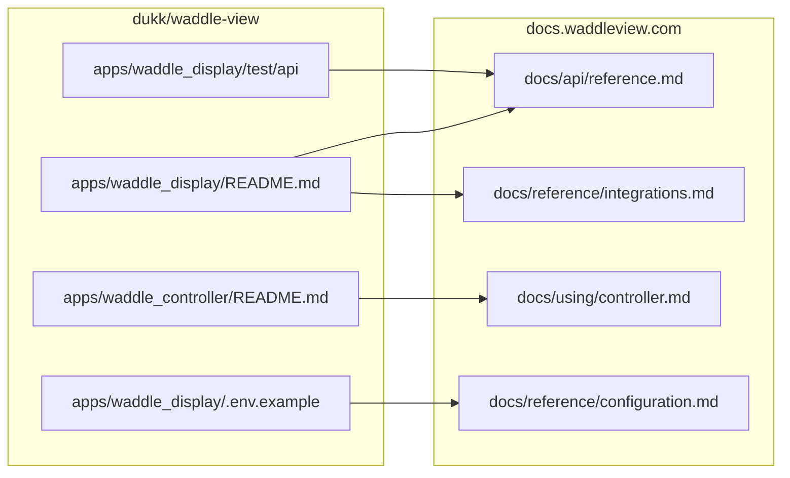

# docs.waddleview.com — design

Human-facing guide for contributors and agents maintaining the public documentation site for [Waddle View](https://waddleview.com/). **Build and deploy steps** live in [`README.md`](README.md). **Agent workflow** is in [`AGENTS.md`](AGENTS.md).

## Purpose

Publish **operator- and integrator-facing** documentation that stays aligned with the product monorepo **[dukk/waddle-view](https://github.com/dukk/waddle-view)**. This repository is **docs-only** (MkDocs Material); it does not ship application code.

| Audience | What they need here |
|----------|---------------------|
| Operators | Pairing, controller workflows, Pi install/upgrade, backups, live preview |
| Integrators / automation | REST API reference, auth, CORS, catalog endpoints |
| Developers (product) | Pointers to waddle-view dev setup; architecture at a high level |
| Doc contributors | Where to edit when product behavior changes |

Marketing copy and brand assets may be copied from **[waddleview.com](https://github.com/dukk/waddleview.com)** into `docs/assets/`; **behavioral truth** comes from waddle-view READMEs, `.env.example`, and route tests.

## Stack

| Piece | Choice |
|-------|--------|
| Generator | [MkDocs](https://www.mkdocs.org/) + [Material for MkDocs](https://squidfunk.github.io/mkdocs-material/) |
| Config | [`mkdocs.yml`](mkdocs.yml) — nav, theme, extensions |
| Content | Markdown under [`docs/`](docs/) |
| CI | [`.github/workflows/docs.yml`](.github/workflows/docs.yml) — `mkdocs build --strict` on `main` → GitHub Pages |
| Live URL | [https://docs.waddleview.com](https://docs.waddleview.com) (`docs/CNAME`) |

**Strict build** fails on broken internal links and unresolved references — treat a green `mkdocs build --strict` as the merge gate (same as CI).

## Information architecture

Seven top-level **tabs** (Material `navigation.tabs`), 22 pages:

```
Home
├── Getting started (overview, dev-setup, architecture)
├── Using Waddle View (display, controller, security)
├── Raspberry Pi (install, upgrade, development)
├── API (overview, reference)
├── Reference (screens, overlays, integrations, ticker, plugins, configuration, waddlectl)
└── Help (troubleshooting, contributing)
```

| Section | Role |
|---------|------|
| **Getting started** | Product mental model, monorepo map, persistence/secrets narrative |
| **Using** | Operator guides (controller SPA, display runtime, security) |
| **Raspberry Pi** | Production install paths (Tier 0–2), upgrade, ARM64 dev notes |
| **API** | Conceptual overview + full REST tables |
| **Reference** | Type catalogs (`screen_type`, integrations, ticker), env vars, CLI |
| **Help** | Troubleshooting matrices, how to contribute / sync |

Prefer **stable operator-facing behavior** in prose; link to waddle-view source paths for implementation detail rather than duplicating code walkthroughs.

## Content sources (sync model)

Documentation is **downstream** of the product. When waddle-view changes, update the matching page here in the same PR (product repo) or a follow-up docs PR.



### Primary source files (waddle-view)

| Topic | Source of truth |
|-------|-----------------|
| REST routes, adoption, catalog | `apps/waddle_display/README.md`, `apps/waddle_display/test/api/` |
| Curator configurations, active program | `apps/waddle_display/README.md`, `lib/api/curator_configuration_routes.dart` |
| Operator UI (backups, live preview, Data) | `apps/waddle_controller/README.md` |
| Env vars (display + BFF) | `apps/waddle_display/.env.example`, `apps/waddle_display/lib/config/display_env.dart` |
| Integration secrets model | `.env.example` comments, `AGENTS.md` (product), Integrations UI |
| CLI | `apps/waddlectl/`, `apps/waddlectl/lib/runner/` |
| Pi deploy | `deploy/`, `docs/pi/` (in-repo; public site mirrors install/upgrade pages) |

### Product → docs mapping

| Product change | Docs page(s) |
|----------------|--------------|
| New `/v1/*` route | `docs/api/reference.md`, often `docs/api/overview.md` |
| Curator configuration / active APIs | `docs/api/reference.md`, `docs/using/controller.md` |
| New `screen_type` | `docs/reference/screens.md` |
| New `integration_type` | `docs/reference/integrations.md` |
| New env var | `docs/reference/configuration.md` |
| SaaS / Postgres deployment | `docs/reference/configuration.md`, `docs/getting-started/architecture.md` |
| `waddlectl` command | `docs/reference/waddlectl.md` |
| Controller operator UX | `docs/using/controller.md`, `docs/using/display.md` |
| Security / secret storage | `docs/using/security.md`, `docs/reference/integrations.md` |

Full table also appears in [`docs/help/contributing.md`](docs/help/contributing.md).

## Narrative conventions (must stay consistent)

These reflect current product behavior; do not revert to older wording without a product change.

1. **Persistence** — SQLite by default; optional **PostgreSQL** via `WADDLE_DISPLAY_DATABASE_URL`. Blobs always on disk under `media/`.
2. **Integration API keys** — configured in the **controller Integrations** UI, stored encrypted on the display. Legacy `WADDLE_DISPLAY_*` provider key env vars are **deprecated and ignored**.
3. **OAuth** — tokens in **SecretStore**; public client ids may remain in env.
4. **Ticker** — in-memory snapshot; tapes configured in SQLite.
5. **Backups (BFF)** — new targets default **weekly Sunday 02:00** controller-local, **+5 min stagger** per display in scope.
6. **Live preview** — defaults width **720**, quality **50**; Linux needs `gst-launch-1.0`.
7. **Optional SaaS** — `WADDLE_SAAS_*` when display runs as cloud feed consumer.

## Assets

| Path | Use |
|------|-----|
| `docs/assets/brand/` | Logo, mascot (theme) |
| `docs/assets/screenshots/` | Controller and display UI captures |
| `docs/assets/*.png`, `architecture.svg` | Hero images, diagrams |

Screenshots are **not** regenerated on every doc edit; add or replace only when UI changes materially.

## Theme and branding

Configured in [`mkdocs.yml`](mkdocs.yml):

- Primary `#0d1b2a`, accent `#e05c6c` (Waddle View palette)
- Font: DM Sans
- Logo: `assets/brand/headshot.svg`
- Extra CSS: [`docs/stylesheets/extra.css`](docs/stylesheets/extra.css)

`extra.homepage`, `extra.product_repo`, and `extra.releases` link out to marketing and GitHub.

## Out of scope for this repo

- Application source, tests, and release binaries (waddle-view)
- Full duplicate of in-repo `docs/pi/api.md` unless explicitly syncing a section
- Per-platform install guides for every CI target (Android, iOS, etc.) — Pi/Linux-centric unless expanded deliberately
- Product CHANGELOG (use [GitHub Releases](https://github.com/dukk/waddle-view/releases))

## Recent sync baseline (2026)

The following product areas were brought into alignment with waddle-view `main` (curator member ops, Trello tasks, Postgres/SaaS, integration secrets, live preview/remote view, backup schedule, ticker date/time presets, weather °F/°C):

- API: `GET /v1/catalog/tasks`, curator configurations, `GET /v1/curator/active`, Google calendars list, stock `category`, schema v52 note
- Guides: controller Data/Tasks, deep links, curators, backups, Remote/live preview
- Reference: `task_board`, `news_grid`, ticker `dateOrder` / `timeFormatPreset`, `waddlectl db migrate-to-postgres`

When adding features after this baseline, extend the same pages rather than new ad-hoc locations.

## Local verification

```bash
pip install -r requirements.txt
mkdocs serve          # http://127.0.0.1:8000
mkdocs build --strict # CI parity
```

## Deployment

- **Default:** GitHub Actions → GitHub Pages (`main`)
- **Optional:** Cloudflare Pages (same build command/output) — do not point the same hostname at both without intent

See [`README.md`](README.md) for DNS (`docs.waddleview.com` CNAME) and one-time Pages settings.
