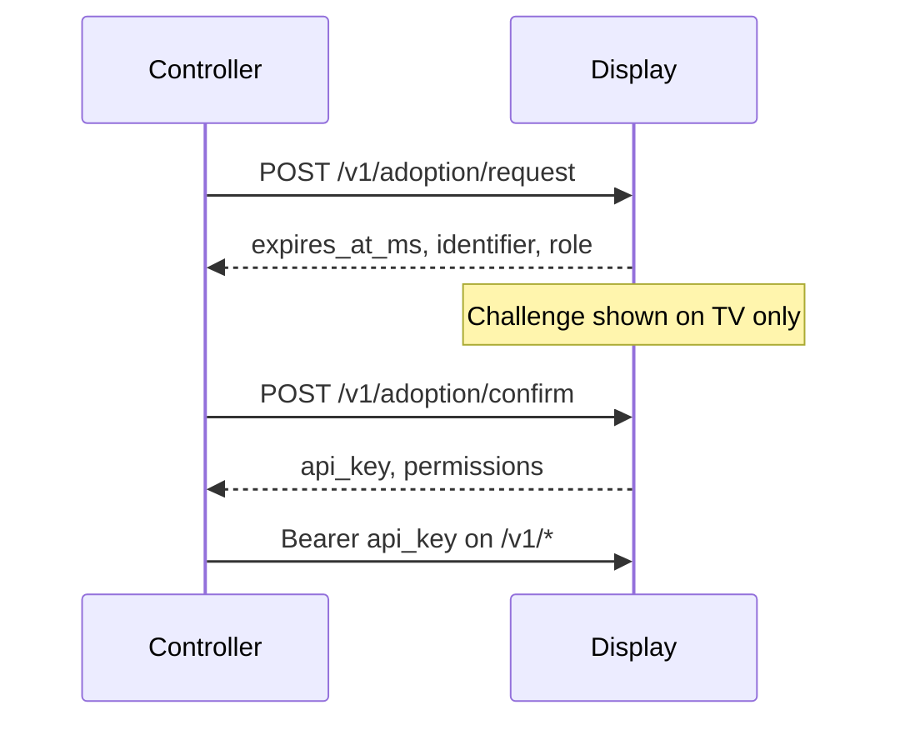

# API overview

The display embeds a **Shelf** REST server on **`0.0.0.0:8787`** (TLS on by default). Operators and automation use **Bearer API keys** after adoption pairing.

## Binding and TLS

| Setting | Default | Purpose |
|---------|---------|---------|
| Port | `8787` | `WADDLE_DISPLAY_HTTP_PORT` |
| Bind | `0.0.0.0` | `WADDLE_DISPLAY_HTTP_BIND_IP` (e.g. `127.0.0.1` for loopback only) |
| TLS | on (`1`) | `WADDLE_DISPLAY_HTTP_TLS=0` for plain HTTP |
| Cert dir | app-support `tls/` | Override with `WADDLE_DISPLAY_HTTP_TLS_DIR`, `_CERT`, `_KEY` |

Adoption URLs use the first non-loopback IPv4 on the host.

## Authentication flow



### Public routes

- `GET /v1/health`
- `POST /v1/adoption/request`
- `POST /v1/adoption/confirm`

### Protected routes

All other `/v1/*` routes require:

```http
Authorization: Bearer wd_...
```

### Roles

| Role | Highlights |
|------|------------|
| `admin` | Maintenance, backups, adoption client admin, full config |
| `operator` | Integrations, screens, curator writes |
| `power_viewer` | Catalog read, navigation, live preview |
| `viewer` | `telemetry.read` only |

## CORS

Controller browsers send `Origin`. Adoption routes allow private LAN origins. Other routes require origins in `cors_allowed_origins` (from adoption) or `WADDLE_DISPLAY_HTTP_CORS_ORIGINS`.

## Key endpoint groups

| Group | Examples |
|-------|----------|
| Health & meta | `/v1/health`, `/v1/meta/config-schemas` |
| Configuration | `/v1/screens`, `/v1/integrations`, `/v1/display/overlays`, `/v1/ticker/tapes` |
| Content catalog | `/v1/catalog/*` (including `/v1/catalog/tasks`), `/v1/content/*` |
| Interests | `/v1/interests/*` |
| Curator | `/v1/curator/manual/*`, `/v1/curator/categories`, `/v1/curator/configurations`, `/v1/curator/active` |
| Tasks catalog | `/v1/catalog/tasks` |
| Integration accounts | `/v1/integration-accounts/{id}/google/calendars` |
| Telemetry | `/v1/telemetry/integrations`, `/v1/telemetry/programs` |
| Maintenance | `/v1/display/backup/*`, `/v1/display/ops/upgrade` |

## Schema discovery

Prefer **`GET /v1/meta/config-schemas`** once per session — returns `screen_types`, `ticker_tape_types`, `overlay_types`, and `integration_types` with JSON Schema and examples.

## Controller BFF

When using **waddle_controller**, the browser calls **`/bff/v1/proxy/*`** on the BFF, which forwards to the display with relaxed TLS verification. Backup targets and scheduled pulls use additional `/bff/v1/backup-*` routes — see [Controller guide](../using/controller.md).

## Full reference

See **[REST API reference](reference.md)** for complete endpoint tables, query parameters, and curl examples.
