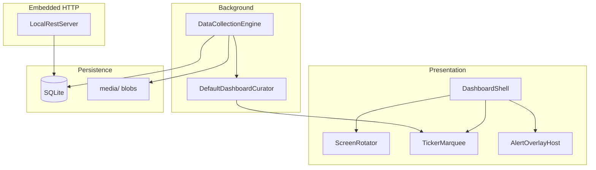

# Architecture

Waddle View runs as a **single process**: Flutter UI, background data collection, and an embedded Shelf HTTP server share one isolate. The composition root is `apps/waddle_display/lib/main.dart`.

## Design principles

- **Ports and adapters** — abstract boundaries (`IDataProvider`, `BlobStore`, `SecretStore`, repositories) with Drift/filesystem implementations
- **Drift as the hub** — screens, integrations, overlays, alerts, and config live in SQLite
- **No static API keys in SQLite** — provider tokens come from environment variables; OAuth tokens use `SecretStore`
- **Ticker in memory** — curated marquee text is not persisted; REST exposes a read-only snapshot

## Runtime diagram

## Module map

## Startup sequence

1. Open SQLite, run migrations, seed defaults
2. Load `SecretStore` and merged environment for `ProviderConfigResolver`
3. Start **DataCollectionEngine** (sequential provider runs)
4. Run initial **curator** refresh (builds slide program + ticker snapshot)
5. Start **LocalRestServer** on `0.0.0.0:8787` (TLS by default)
6. `runApp` — `ScreenRotator`, `TickerMarquee`, overlay host

On dispose: stop engine, close HTTP server, close database.

## Data flow

1. **Collectors** (`waddle_integrations`) fetch external data and write rows + blobs via `DataWriteContext`
2. **Curator** reads SQLite + in-memory rules to produce the active **slide program** and **ticker items**
3. **UI** renders the current slide; ticker scrolls independently; overlays schedule by calendar rules
4. **Controller / REST** mutates configuration; display hot-reloads programs on the next curator cycle

## Related docs

- [Display runtime](../using/display.md)
- [REST API overview](../api/overview.md)
- [Security model](../using/security.md)
- Upstream: [ARCHITECTURE.md](https://github.com/dukk/waddle-view/blob/main/apps/waddle_display/ARCHITECTURE.md)
