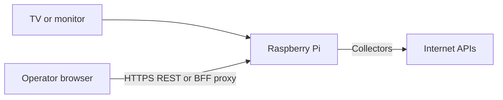

# Overview

**Waddle View** is a TV dashboard platform: an always-on display that rotates slides, shows a scrolling bottom ticker, plays scheduled celebration overlays, and ingests data from built-in integrations and optional HTTP plugins.

It is optimized for **Raspberry Pi** (Linux ARM64) while supporting **Windows** and **Linux x64** for development.

## What you get

| Layer | Description |
|-------|-------------|
| **Display** | Flutter app: slide rotator, ticker marquee, overlay host, local HTTPS REST on port **8787** |
| **Persistence** | SQLite (Drift) for configuration and catalog data; filesystem **blob store** for media |
| **Data engine** | Sequential collectors (`IDataProvider`) write into SQLite; curator builds slide/ticker programs |
| **Controller** | React operator UI; optional Node BFF proxies API calls to displays |
| **Security** | Role-based API keys (`admin`, `operator`, `power_viewer`, `viewer`); integration secrets encrypted in SQLite |

## Typical deployment

1. Install **waddle_display** on a Pi or PC connected to a TV.
2. Pair the **controller** using the on-screen adoption challenge.
3. Configure integrations, screens, ticker tapes, and overlays.
4. Let the display run; data refreshes on a background schedule.

## Applications in the monorepo

| Path | Purpose |
|------|---------|
| `apps/waddle_display` | TV dashboard (main product) |
| `apps/waddle_controller` | Operator web UI + Hono BFF |
| `apps/waddlectl` | CLI backup/restore |
| `packages/waddle_shared` | Drift schema, collectors core, auth |
| `packages/waddle_integrations` | Built-in data providers |
| `packages/waddle_plugin_sdk` | Plugin author SDK |

## Next steps

- [Development setup](dev-setup.md) — run locally on Windows or Linux
- [Architecture](architecture.md) — runtime modules and data flow
- [Install on Raspberry Pi](../raspberry-pi/install.md) — production deployment
- [Controller guide](../using/controller.md) — operator workflow
