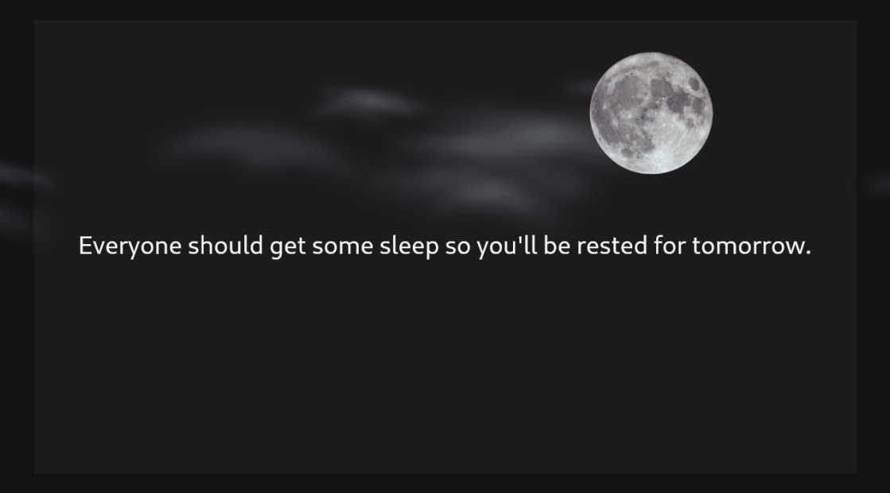

# Welcome to Waddle View Docs

This is the documentation for [Waddle View](https://waddleview.com/) — a **local-first TV dashboard** that runs on hardware you already own (Raspberry Pi, Linux desktop, Windows for development). Data stays on your network; operators configure displays through a browser **controller** or the embedded **REST API**.

It covers setup, daily operation, Pi deployment, API reference, and type catalogs. Contributions are welcome on [GitHub](https://github.com/dukk/docs.waddleview.com).

{ .waddle-hero width="720" }

## Where to start

-   :octicons-rocket-24:{ .lg .middle } __Getting started__

    ---

    What Waddle View is and how to run it locally for the first time.

    [:octicons-arrow-right-24: Overview](getting-started/overview.md)

-   :octicons-device-desktop-24:{ .lg .middle } __Install on Raspberry Pi__

    ---

    One-line install, release tarballs, systemd, and upgrades.

    [:octicons-arrow-right-24: Pi install](raspberry-pi/install.md)

-   :octicons-gear-24:{ .lg .middle } __Operator controller__

    ---

    Pair a display, manage screens, integrations, and backups.

    [:octicons-arrow-right-24: Controller guide](using/controller.md)

-   :octicons-plug-24:{ .lg .middle } __REST API__

    ---

    Adoption pairing, roles, and endpoint reference.

    [:octicons-arrow-right-24: API overview](api/overview.md)

-   :octicons-screen-full-24:{ .lg .middle } __Screen & overlay types__

    ---

    Catalog of built-in slide and celebration overlay types.

    [:octicons-arrow-right-24: Screens](reference/screens.md)

-   :octicons-database-24:{ .lg .middle } __Integrations__

    ---

    Weather, news, photos, calendars, stocks, and more.

    [:octicons-arrow-right-24: Integrations](reference/integrations.md)

## About Waddle View

Waddle View is the successor to [Quackview](https://github.com/dukk/quackview), rebuilt for **better visual performance on Raspberry Pi**. A single Flutter process rotates configurable **slides**, shows a bottom **news ticker**, layers scheduled **overlays**, and collects data from 30+ built-in **integrations** into SQLite.

| Component | Role |
|-----------|------|
| **waddle_display** | Always-on TV app (Flutter + Drift + Shelf REST) |
| **waddle_controller** | Operator web UI + optional BFF proxy |
| **waddlectl** | CLI backup/restore against the display database |

## External links

- [Product site](https://waddleview.com/)
- [Source code](https://github.com/dukk/waddle-view)
- [Releases & downloads](https://github.com/dukk/waddle-view/releases)
