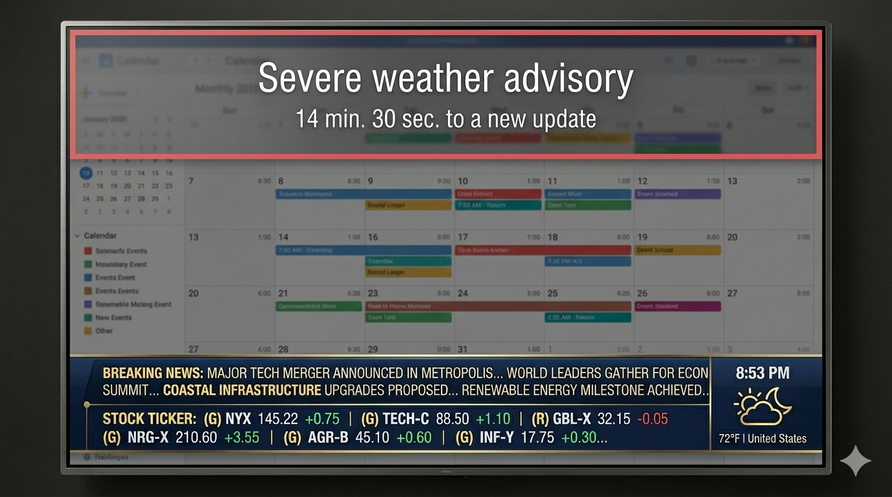

# Overlay types

Overlays are scheduled effects drawn above the slide program (confetti, clocks, QR codes, etc.). Stored in SQLite `overlays` with `overlay_type` and `config_json`.

```http
GET /v1/display/overlays
POST /v1/display/overlays
PATCH /v1/display/overlays/{id}
DELETE /v1/display/overlays/{id}
```

Global disable: set `display.overlay.enabled` to `false` in `config_key_values` (or via `PUT /v1/config/key-values`).

{ width="480" }

## Built-in overlay types

| `overlay_type` | Label | Description |
|----------------|-------|-------------|
| `shape_rain` | Shape rain | Falling shapes (legacy `hearts_rain` migrates here) |
| `birthday_confetti` | Birthday confetti | Confetti + optional messages |
| `bouncing_message` | Bouncing message | DVD-style bouncing phrase |
| `falling_images` | Falling images | Uploaded images drift down |
| `matrix_rain` | Matrix rain | Green character columns |
| `edge_glow` | Edge glow | Pulsing edge vignette (alarms) |
| `floating_balloons` | Floating balloons | Balloons from bottom |
| `cloud_drift` | Cloud drift | Drifting cloud shapes |
| `static_image` | Static image | Full-screen image overlay |
| `digital_clock` | Digital clock | Time overlay |
| `analog_clock` | Analog clock | Analog clock overlay |
| `calendar_month` | Calendar month | Month calendar overlay |
| `calendar_upcoming` | Calendar upcoming | Upcoming events list |
| `stock_quote` | Stock quote | Single symbol highlight |
| `photo_slideshow` | Photo slideshow | Rotating photos |
| `qr_code` | QR code | QR from config payload |
| `plugin_template` | Plugin template | Plugin celebration layer |
| `plugin_web` | Plugin web | Plugin WebView overlay |

## Scheduling fields

| Field | Purpose |
|-------|---------|
| `repeat_annually` | Repeat every year on start date |
| `start_month`, `start_day` | Start of window (required) |
| `end_month`, `end_day` | Optional end (inclusive span) |
| `year_exact` | Pin to one calendar year |
| `nth_week_of_month`, `nth_weekday` | Nth weekday rule (both required) |

Messages for phrase-based overlays live under `config_json.messages`.

## Example: birthday confetti

```bash
curl -sS -H "Authorization: Bearer $TOKEN" -H 'Content-Type: application/json' \
  -d '{
    "id": "birthday_alex",
    "enabled": true,
    "overlay_type": "birthday_confetti",
    "label": "Alex birthday",
    "config_json": {
      "messages": ["Happy birthday, Alex!"],
      "colors": ["#E05C6C", "#FFE356"],
      "density": 0.36
    },
    "repeat_annually": true,
    "start_month": 6,
    "start_day": 12
  }' \
  https://127.0.0.1:8787/v1/display/overlays
```

See [REST API reference](../api/reference.md) for full request shapes.

## Next steps

- [Plugins](plugins.md)
- [Display runtime](../using/display.md)
