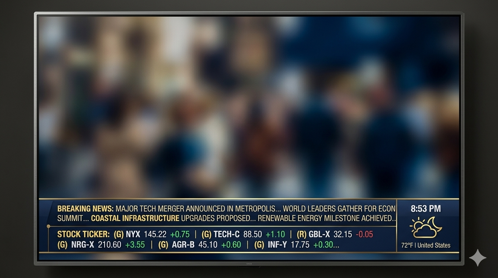

# Ticker

The bottom **ticker marquee** shows curated lines built by the dashboard curator from enabled **ticker tapes**, interests data, and plugins. Text is **in-memory only** — not stored in SQLite.

## Read current items

```http
GET /v1/ticker/items
```

Returns `ordinal`, `kind`, and `body` for each active line (read-only snapshot).

{ width="480" }

## Ticker tapes

Tapes are configuration rows (`ticker_tapes`) with a `ticker_type` and `config_json`:

```http
GET /v1/ticker/tapes
POST /v1/ticker/tapes
PATCH /v1/ticker/tapes/{id}
DELETE /v1/ticker/tapes/{id}
```

| Field | Purpose |
|-------|---------|
| `frequency_weight` | Relative selection weight |
| `sort_order` | Ordering hint |
| `enabled` | Include when true |

Schema per type:

```http
GET /v1/meta/ticker-tape-types
GET /v1/meta/config-schemas   # includes ticker_tape_types
```

## Built-in ticker kinds

Common tape types include (exact ids in meta schemas):

| Kind | Content |
|------|---------|
| Time | Clock / date in display timezone |
| Weather | Current conditions from interests locations |
| News | Headlines from RSS collectors |
| Quote | Quote integration |
| Stocks | Symbols from interests |
| Static text | Operator-defined line |
| Plugin | `ticker_type: plugin` or KV `ticker.marquee.<plugin_id>` |

### Time tape (`time`)

When **`dateOrder`** and **`timeFormatPreset`** are omitted, the tape follows display settings **`controller_date_order`** and **`controller_time_format`**.

| `config_json` key | Purpose |
|-------------------|---------|
| `dateOrder` | `mdy`, `dmy`, or `ymd` — overrides display default |
| `timeFormatPreset` | e.g. `24h_hms`, `12h_hm_tt` — overrides display time format |
| `timeZone` | Optional IANA zone |
| `labelPrefix` | Optional prefix before date/time |

The marquee ticks every second when the preset includes seconds; otherwise about once per minute.

### Weather tape (`weather`)

| `config_json` key | Purpose |
|-------------------|---------|
| `locationId` | `interests_locations` row |
| `temperatureUnit` | `c` or `f` — overrides `display.weather.temperature_unit` |

Collectors store temperatures in **°C**; the display formats using the effective unit.

## Telemetry

Recent ticker programs are available for debugging:

```http
GET /v1/telemetry/ticker-programs?limit=10
```

Requires appropriate telemetry permissions.

## Content policy

Operators with `content.moderate` can suppress jokes, RSS articles, photos, and videos from **both** slides and ticker via `PATCH /v1/content/*`.

## Next steps

- [Display runtime](../using/display.md)
- [Integrations](integrations.md)
