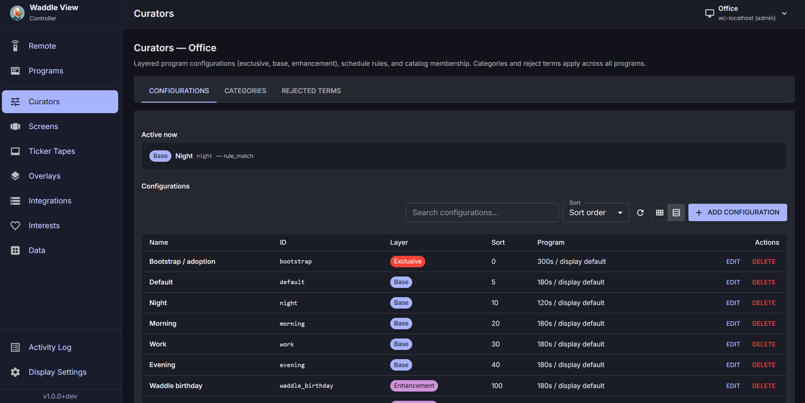
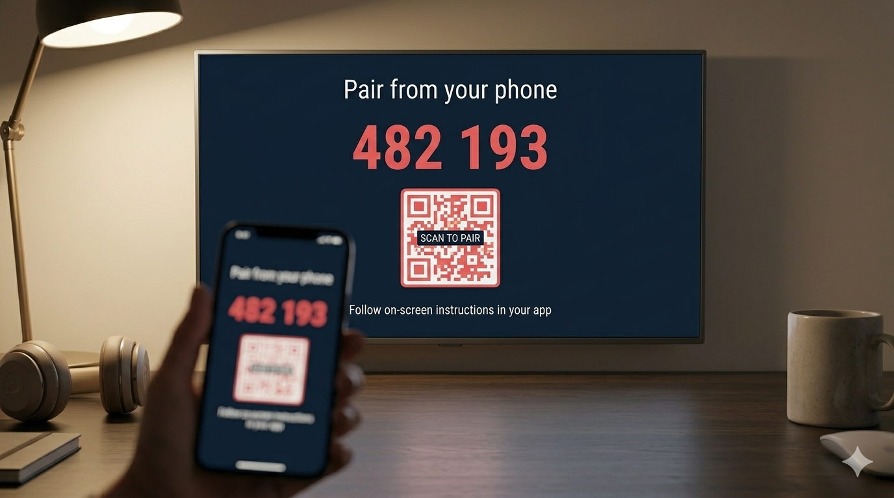
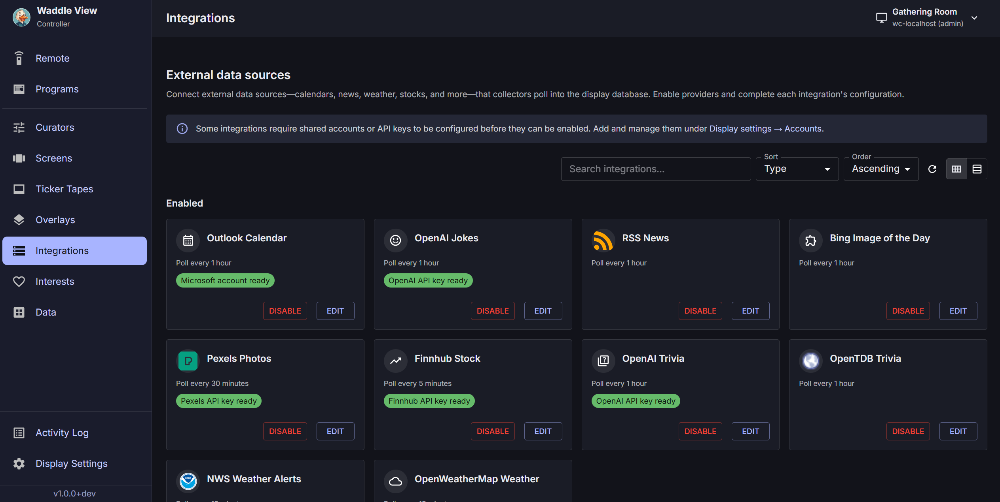

# Operator controller

**waddle_controller** is the browser UI for managing one or more displays. It pairs via the adoption API, then proxies all display REST traffic through an optional **BFF** (Hono + SQLite or Postgres) so the browser never talks to self-signed display TLS directly.

{ width="640" }

## Development

From `apps/waddle_controller/` in the waddle-view repo:

```bash
npm ci
npm run dev
```

- SPA: **https://127.0.0.1:5173**
- BFF: **https://127.0.0.1:5199** (proxies `/bff/v1/proxy/*` to each display)

Set `WADDLE_CONTROLLER_TLS=0` for plain HTTP in dev.

## Pairing a display

{ width="480" }

1. Add the display URL in the controller (LAN HTTPS, e.g. `https://192.168.1.50:8787`).
2. **Request adoption** — `POST /v1/adoption/request` with an identifier and role.
3. Read the **XXXX-XXXX** challenge on the TV (security alert overlay).
4. **Confirm** — `POST /v1/adoption/confirm` with the code; store the returned `api_key`.
5. The display records your browser **Origin** in `cors_allowed_origins` for later API calls.

Admins can issue keys instantly with an existing admin bearer token. See [Security](security.md) and [API overview](../api/overview.md).

## Main workflows

| Area | What you configure |
|------|-------------------|
| **Programs / Curators** | Layered configurations (exclusive, base, enhancement), schedule rules, member add/remove ops, **Active now** preview |
| **Screens** | Per-slide types; **Require news photo** on news-family screens |
| **Integrations** | Enable providers, API keys, OAuth accounts; **View data** deep links |
| **Data** | Browse and moderate jokes, news, photos, tasks, etc. |
| **Ticker** | Tape types, weights, date/time format presets |
| **Overlays** | Celebration schedules and assets |
| **Display settings** | Theme, timezone, adoption policy, backup |
| **Controller settings** | Users, scheduled backups, Pi upgrade |
| **Remote** | Live preview stream, save frame, pop-out window |

{ width="640" }

Schema-driven forms use JSON Schema from `GET /v1/meta/config-schemas` — prefer caching that response once per session.

## Curators

Curator **configurations** stack by layer and `sort_order`:

- **exclusive** — replaces the whole program (bootstrap/adoption)
- **base** — primary program (screens, ticker, theme, viewport reserve)
- **enhancement** — add/remove member ops for screens, ticker tapes, and overlays when schedules match

**Members** use `add` or `remove` ops per catalog id (not just id lists). Higher `sort_order` wins when the same id is both added and removed.

**Active now** (`GET /v1/curator/active`) shows matching configurations plus **`program_controls`** and **`effective_members`** (merged ids with labels — same resolution the display rotator uses).

**Require news photo** can be set per curator (`require_news_photo_for_screens`) and per news-family screen row on **Screens**.

## Data and integrations

The **Data** page lists ingested catalog rows by kind. Filter by text, category, integration, or suppression state.

- **Tasks** tab — synced Trello cards (`GET /v1/catalog/tasks`); filter by **board key**
- From **Integrations**, **View data** opens Data with query params: `/data?kind=…&integration_type=…`

**Google Calendar** setup mirrors Outlook: pick a signed-in account, set day windows, **refresh calendar list** (`GET /v1/integration-accounts/{id}/google/calendars`), assign categories per calendar.

## Duration fields

Poll intervals, dwell times, and similar fields accept **seconds**, **minutes**, **hours**, or **days** with unit selectors in the controller UI.

## Multi-display and catalog copy

The controller can manage multiple adopted displays. Catalog copy flows duplicate screens, overlays, or integration settings between displays (admin/operator permissions apply).

## Backup and restore

- **Display settings → Backup & restore** — pull or push archives via display admin API (`display.maintenance`)
- **Controller settings → Backup & restore** — scheduled pulls into BFF storage, retention, restore to display

New backup targets default to **weekly on Sunday at 02:00** controller local time. Each additional display in the same scope is staggered **+5 minutes**. Use the unified schedule dialog for frequency, day-of-week, time, and retention.

Archives match **waddlectl** layout (`manifest.json`, `db/`, `media/`).

## Live preview and Remote

Enable live preview under **Controller settings → Displays → Edit → Live preview** (display env defaults: width **720**, quality **50**).

On the **Remote** page:

- **Test live preview** — JPEG stream over WebSocket (ticket + API-key proxy via `/bff/v1/proxy-ws/*`)
- **Save frame** — download the latest preview frame as JPEG or PNG
- **Open in new window** — `/remote/view` pop-out with minimal chrome; window size/position remembered in `localStorage` (`waddle_live_preview_popout_bounds_v1`)
- **Remote controls** accordion — slide/ticker navigation and alert dismiss (same keyboard shortcuts as main Remote: ← → slides, ↑ ↓ ticker, Enter dismiss)

## Pi in-band upgrade

When `GET /v1/health` reports `upgrade_capable: true`, the controller can trigger `POST /v1/display/ops/upgrade` (requires upgrade script + passwordless sudo). See [Pi upgrade](../raspberry-pi/upgrade.md).

## Optional BFF authentication

Enable `WADDLE_CONTROLLER_AUTH_ENABLED=1` and `WADDLE_CONTROLLER_SESSION_SECRET` for multi-user sign-in. Displays and API keys are stored per account in `user_displays`.

## Next steps

- [Security model](security.md)
- [REST API reference](../api/reference.md)
- [waddlectl CLI](../reference/waddlectl.md)
